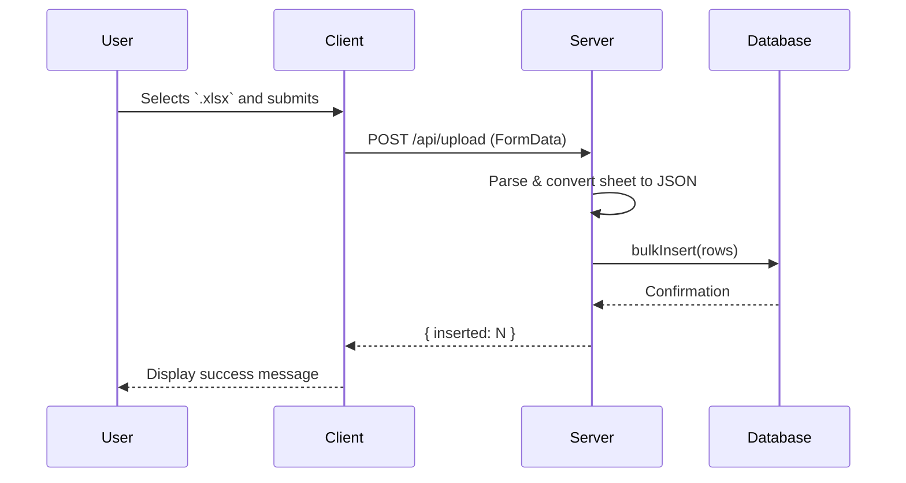

# Project Overview

This Marvel Tech Test project comprises two main parts: a React-based client and an Express-powered server.  

- The client fetches paginated Marvel characters and allows uploading Excel (.xlsx) files.
- The server exposes REST endpoints to retrieve characters (with caching) and process uploaded spreadsheets into a SQLite database.

---

## Client Application

### src/main.tsx

This is the React entry point. It renders the <code></code> component into the DOM.  

```javascript
import { StrictMode } from 'react';
import { createRoot } from 'react-dom/client';
import './index.css';
import App from './App.tsx';

createRoot(document.getElementById('root')!).render(
  <StrictMode>
    <App />
  </StrictMode>,
);
```

- StrictMode enables additional checks and warnings.
- Vite handles HMR and bundling.

---

### src/App.tsx

This component displays a paginated list of Marvel characters fetched from the server.  

```javascript
function App() {
  type Character = { id: number; name: string; thumbnail: string; };
  const [chars, setChars] = useState<Character[]>([]);
  const [page, setPage] = useState(1);

  useEffect(() => {
    fetch(`${import.meta.env.VITE_API_URL}/api/characters?page=${page}`)
      .then(r => r.json())
      .then(setChars);
  }, [page]);

  return (
    <main className="container">
      <h1>Marvel Characters</h1>
      <section className="grid">
        {chars.map(ch => (
          <article key={ch.id} className="card">
            
            <h3>{ch.name}</h3>
          </article>
        ))}
      </section>
      <footer>
        <button onClick={() => setPage(p => p - 1)} disabled={page === 1}>Prev</button>
        <button onClick={() => setPage(p => p + 1)}>Next</button>
      </footer>
    </main>
  );
}
export default App;
```

- useEffect triggers data fetch on page change.
- Grid layout presents character cards.

---

### src/Upload.jsx 📤

This Upload component provides a form to send an <code>.xlsx</code> file to the server.  

```javascript
export default function Upload() {
  const [msg, setMsg] = useState('');

  async function onSubmit(e) {
    e.preventDefault();
    const fd = new FormData(e.target);
    const r = await fetch(`${import.meta.env.VITE_API_URL}/api/upload`, {
      method: 'POST',
      body: fd
    });
    const j = await r.json();
    setMsg(j.inserted ? `Inserted ${j.inserted} rows` : j.error);
  }

  return (
    <form onSubmit={onSubmit}>
      <input type="file" name="file" accept=".xlsx" required />
      <button>Upload</button>
      <p>{msg}</p>
    </form>
  );
}
```

Key Details:  

| Feature | Description |
| --- | --- |
| State | <code>msg</code> holds the server response message. |
| onSubmit | Prevents default, builds <code>FormData</code>, calls <code>/api/upload</code>. |
| Form Elements | File input (<code>.xlsx</code>) + submit button + message display. |

This component relies on the <code>VITEAPIURL</code> environment variable to target the server endpoint.   

---

## Server Application

### server/index.js 🚀

Sets up an Express app with two endpoints and static file serving.  

```javascript
import "dotenv/config";
import express from "express";
import cors from "cors";
import { url } from "./marvel.js";
import { cache } from "./cache.js";
import axios from "axios";
import multer from "multer";
import xlsx from "xlsx";
import { bulkInsert } from "./db.js";

const app = express();
const upload = multer({ dest: "uploads/" });
const port = process.env.PORT || 4000;

app.use(cors());
app.use(express.static("public"));
app.use(express.json());

// Character pagination endpoint...
app.get("/api/characters", async (req, res) => { /* ... */ });

// Excel upload endpoint...
app.post("/api/upload", upload.single("file"), (req, res) => { /* ... */ });

app.listen(port, () => console.log(`Listening on port ${port}`));
```

- CORS enabled for cross-origin requests.
- Multer handles file parsing.
- xlsx parses Excel files.
- bulkInsert stores rows in SQLite.

---

### server/cache.js ⏱️

A simple in-memory cache with TTL to avoid repeated Marvel API calls.  

```javascript
import NodeCache from 'node-cache';
export const cache = new NodeCache({ stdTTL: 600 });
```

- stdTTL: cached items expire after 600 seconds.

---

### server/db.js 💾

Initializes SQLite3 database, ensures schema, and provides a bulkInsert function.  

```javascript
import Database from "better-sqlite3";
import { readFileSync, mkdirSync } from "fs";
import { dirname, join } from "path";
import { fileURLToPath } from "url";

const __dirname = dirname(fileURLToPath(import.meta.url));
const dbDir = join(__dirname, "..", "db");
mkdirSync(dbDir, { recursive: true });

const db = new Database(join(dbDir, "data.db"));
db.exec(readFileSync(join(__dirname, "..", "db", "schema.sql"), "utf8"));

const stmt = db.prepare("INSERT INTO upload_rows (col_a, col_b, col_c) VALUES (?, ?, ?)");
export function bulkInsert(rows) {
  const insertMany = db.transaction(data => {
    for (const r of data) stmt.run(r.col_a, r.col_b, r.col_c);
  });
  insertMany(rows);
}
```

- Creates <code>db</code> directory if missing.
- Executes SQL schema on startup.
- Wraps inserts in a transaction for performance.

---

### server/marvel.js 🔗

Constructs authenticated URLs for the Marvel API.  

```javascript
import axios from "axios";
import crypto from "crypto";

const { MARVEL_PUBLIC_KEY, MARVEL_PRIVATE_KEY } = process.env;
const base = "https://gateway.marvel.com/v1/public";

export function url(path, extra = {}) {
  const ts = Date.now();
  const hash = crypto.createHash("md5")
    .update(ts + MARVEL_PRIVATE_KEY + MARVEL_PUBLIC_KEY)
    .digest("hex");
  const params = new URLSearchParams({ ts, apikey: MARVEL_PUBLIC_KEY, hash, ...extra });
  return `${base}${path}?${params}`;
}
```

- Adds ts, apikey, and hash for Marvel’s authentication.

---

## Database Schema

### db/schema.sql

Defines the upload_rows table for storing spreadsheet data.  

```sql
CREATE TABLE IF NOT EXISTS upload_rows (
  id      INTEGER PRIMARY KEY AUTOINCREMENT,
  col_a   TEXT,
  col_b   TEXT,
  col_c   TEXT
);
```

- Columns A, B, C map to Excel columns <code>A</code>, <code>B</code>, <code>C</code>.

---

## API Endpoints 📡

```api
{
    "title": "List Characters",
    "description": "Fetches a paginated list of Marvel characters",
    "method": "GET",
    "baseUrl": "https://api.example.com",
    "endpoint": "/api/characters",
    "headers": [],
    "queryParams": [
        {
            "key": "page",
            "value": "Page number for pagination",
            "required": false
        }
    ],
    "pathParams": [],
    "bodyType": "none",
    "requestBody": "",
    "formData": [],
    "rawBody": "",
    "responses": {
        "200": {
            "description": "Success",
            "body": "[{ \"id\": 1009610, \"name\": \"Spider-Man\", \"thumbnail\": \"...\" }, ...]"
        },
        "500": {
            "description": "Server Error",
            "body": "{ \"error\": \"...\" }"
        }
    }
}
```

```api
{
    "title": "Upload Excel File",
    "description": "Uploads an .xlsx file and inserts its rows into the database",
    "method": "POST",
    "baseUrl": "https://api.example.com",
    "endpoint": "/api/upload",
    "headers": [],
    "queryParams": [],
    "pathParams": [],
    "bodyType": "form",
    "requestBody": "",
    "formData": [
        {
            "key": "file",
            "value": "Excel file (.xlsx)",
            "required": true
        }
    ],
    "rawBody": "",
    "responses": {
        "200": {
            "description": "Rows Inserted",
            "body": "{ \"inserted\": 42 }"
        },
        "500": {
            "description": "Error processing file",
            "body": "{ \"error\": \"...\" }"
        }
    }
}
```

---

## Data Flow Diagram 🗺️



---

## Configuration &amp; Tooling

- Vite for client bundling (<code>vite.config.ts</code>).
- Nodemon for live server reloads.
- dotenv for environment variables (<code>VITEAPIURL</code>, Marvel keys).
- better-sqlite3, multer, xlsx, node-cache, axios, express, cors as core dependencies.

---

Enjoy exploring Marvel characters and seamlessly importing your Excel data!